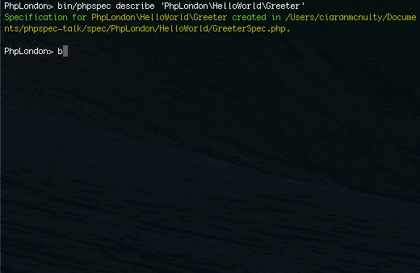
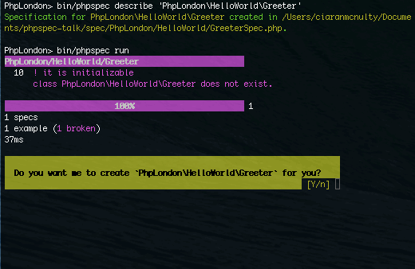
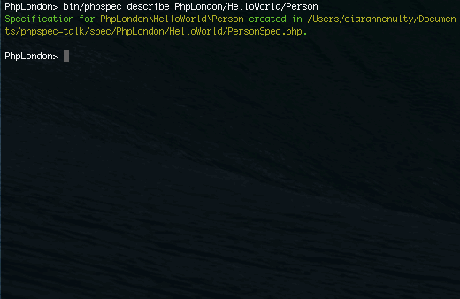

# Driving Development with PhpSpec
## with Ciaran McNulty
### PHPLondon November 2014

---

# My experiences

*  Unit testing since 2004
*  Test Driven Development since 2005(ish)
*  Behaviour Driven Development since 2012

---

#[fit] TDD vs BDD

#[fit] \(or are they the same?\)

---

> BDD is a second-generation, outside-in, pull-based, multiple-stakeholder…
-- Dan North

---

> …multiple-scale, high-automation, agile methodology.
-- Dan North

---

> BDD is the art of using examples in conversation to illustrate behaviour
-- Liz Keogh

---

# Test Driven Development

* Before you write your code, **write a test that validates how it should behave**
* After you have written the code, **see if it passes the test**
* Once in production, the **test acts as documentation**

---

# Behaviour Driven Development

* Before you write your code, **describe how it should behave using examples**
* After you have written the code, **check it does what you described**
* Once in production, the **description acts as documentation**

----

# Image 

How PHPUnit, Behat and PhpSpec fit in together

----

# SpecBDD with PhpSpec
## Describing individual classes

---

# Installation via Composer

```json
{
    "require-dev": {
        "phpspec/phpspec": "~2.1-RC1"
    },
    "config": {
        "bin-dir": "bin"
    },
    "autoload": {"psr-0": {"": "src"}}
}
```

---
 


---

# Describing object behaviour 

* We **describe an object** using a **Specification**
* A specification is made up of **Examples** illustrating different scenarios

---


---

#[fit] /spec/PhpLondon/HelloWorld/GreeterSpec.php

```php

namespace spec\PhpLondon\HelloWorld;

use PhpSpec\ObjectBehavior;
use Prophecy\Argument;

class GreeterSpec extends ObjectBehavior
{
    function it_is_initializable()
    {
        $this->shouldHaveType('PhpLondon\HelloWorld\Greeter');
    }
}

```

---

# Verifying object behaviour 

* Compare the real object's behaviour with the examples

---



---



---

#[fit] /src/PhpLondon/HelloWorld/Greeter.php

```php

namespace PhpLondon\HelloWorld;

class Greeter
{
}
```

---

## An example:
# When this greets, it should return "Hello!"

---

#[fit] /spec/PhpLondon/HelloWorld/GreeterSpec.php

```php

class GreeterSpec extends ObjectBehavior
{
    function it_greets_with_hello()
    {
        $this->greet()->shouldReturn('Hello!');
    }
}

```

---


---

#[fit] /src/PhpLondon/HelloWorld/Greeter.php

```php

class Greeter
{
    public function greet()
    {
        // TODO: write logic here
    }
}
```
---

# Faking

* Do the simplest thing that works

Fake using: `phpspec run --fake`

---


---

#[fit] /src/PhpLondon/HelloWorld/Greeter.php

```php

class Greeter
{
    public function greet()
    {
        return 'Hello!';
    }
}
```

---

# Matchers

* Describe what a return value should **be** (===) using **shouldReturn** or **shouldBe** [^1]
* Describe what **type** should be returned using **shouldHaveType** or **shouldBeAnInstanceOf** [^1]
* More built in, or define your own matchers

[^1]: Many aliases are available

---

## Another example:
# When this greets Bob, it should return "Hello, Bob!"

---


---

# [fit] /spec/PhpLondon/HelloWorld/PersonSpec.php

```php
class PersonSpec extends ObjectBehavior
{
    function let()
    {
        $this->beConstructedWith('Ciaran');
    }

    function it_returns_the_name_it_is_created_with()
    {
        $this->getName()->shouldReturn('Ciaran');
    }
}
```

---



---

# [fit] /src/PhpLondon/HelloWorld/Person.php

```php
class Person
{
    public function __construct($argument1)
    {
        // TODO: write logic here
    }

    public function getName()
    {
        // TODO: write logic here
    }
}
```
---

# [fit] /src/PhpLondon/HelloWorld/Person.php

```php
class Person
{
    private $name;

    public function __construct($name)
    {
        $this->name = $name;
    }

    public function getName()
    {
       return $this->name;
    }
}
```
---


---

# Specifying collaboration

* Integrated with **Prophecy**, which provides Doubles of objects

* We want a **Stub** of a Person whose name we can control

---

#[fit] /spec/PhpLondon/HelloWorld/GreeterSpec.php

```php
class GreeterSpec extends ObjectBehavior
{
    //…
    
    function it_greets_people_by_name(Person $person)
    {
        $person->getName()->willReturn('Bob');
        
        $this->greet($person)->shouldReturn('Hello, Bob!');
    }
}

```
---

# Animation

Suite failing on greeting Bob

---

#[fit] /src/PhpLondon/HelloWorld/Greeter.php

```php

class Greeter
{
    public function greet(Person $person = null)
    {
        $greeting = 'Hello';
        if ($person) {
            $greeting .= ', ' . $person->getName();
        }
        $greeting .= '!';

        return $greeting;
    }
}
```

