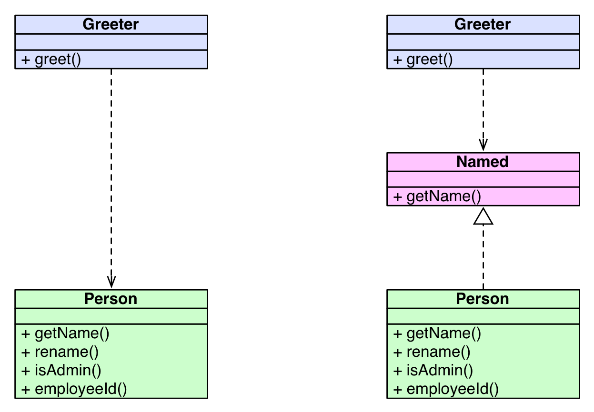
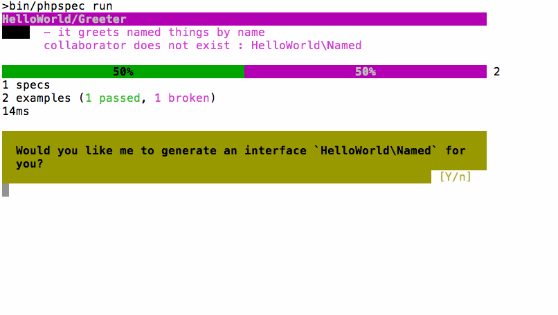
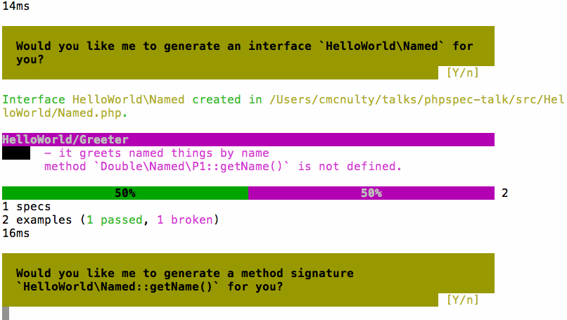
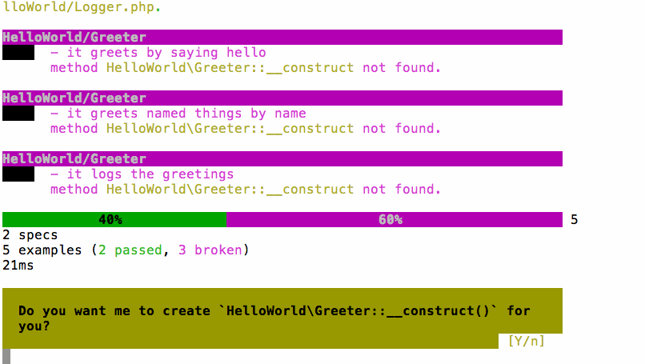

autoscale: true

# Driving Development with PhpSpec
## with Ciaran McNulty
###  Nomad PHP, August 2015

---

#[fit] TDD vs BDD

#[fit] \(or are they the same?\)

---

> BDD is a second-generation, outside-in, pull-based, multiple-stakeholder…
-- Dan North

---

> …multiple-scale, high-automation, agile methodology.
-- Dan North

^ Does make perfect sense if you unpack it

---

> BDD is the art of using examples in conversation to illustrate behaviour
-- Liz Keogh

---

# Test Driven Development

* Before you write your code, **write a test that validates how it should behave**
* After you have written the code, **see if it passes the test**


---

# Behaviour Driven Development

* Before you write your code, **describe how it should behave using examples**
* Then, **Implement the behaviour you described**


^ TDD focuses on tests and gets design benefits as a bonus

^ BDD focuses on descripiveness and gets testing as a bonus

----


^ Explain axes

----


^ Angled towards testing, rather than trying to be descriptive

^ Can be used for all scales

^ Consequently isn't optimised for any scale

^ Multi-tool

----


----


^ Specialisation = optimisation

^ Can assume you want to test one class at a time

---

# SpecBDD with PhpSpec
## Describing individual classes

---

# History


## 1.0 - Inspired by RSpec

* Pádraic Brady and Travis Swicegood

---

# History

## 2.0beta - Inspired by 1.0

* Marcello Duarte and Konstantin Kudryashov (Everzet)
* Ground-up rewrite
* No BC in specs

---

# Design principles

* Optimise for descriptiveness
* Encourage good design
* Encourage TDD cycle
* Do it the PHP way

---

# History

## 2.0.0 to 2.2.0 - Steady improvement

* Me
* Christophe Coevoet
* Jakub Zalas
* Richard Miller
* Gildas Quéméner
* Luis Cordova + MANY MORE

---

# Installation via Composer

```json
{
    "require-dev": {
        "phpspec/phpspec": "~2.0"
    },
    "config": {
        "bin-dir": "bin"
    },
    "autoload": {"psr-0": {"": "src"}}
}
```

---
 


---

## A requirement:
# We need a component that greets people

---

# Describing object behaviour 

* We **describe an object** using a **Specification**
* A specification is made up of **Examples** illustrating different scenarios

Usage:
`phpspec describe [Class]`

---


^ Talk about forward slashes + escaping

---

```php
# spec/HelloWorld/GreeterSpec.php

namespace spec\HelloWorld;

use PhpSpec\ObjectBehavior;
use Prophecy\Argument;

class GreeterSpec extends ObjectBehavior
{
    function it_is_initializable()
    {
        $this->shouldHaveType('HelloWorld\Greeter');
    }
}

```

---

# Verifying object behaviour 

* Compare the real objects' behaviours with the examples

Usage:
`phpspec run`

---


---


---

```php
# src/HelloWorld/Greeter.php

namespace HelloWorld;

class Greeter
{
}
```

^ Template is customisable
^ @author for narcissists
^ Nothing here yet - describe its behaviour using examples

---

## An example for Greeter:
# When this greets, it should return "Hello"

^ Conversation with who?
^ A Pair, a colleague, yourself in 2 weeks

---


```php
# spec/HelloWorld/GreeterSpec.php

class GreeterSpec extends ObjectBehavior
{
    // ...

    function it_greets_by_saying_hello()
    {
        $this->greet()->shouldReturn('Hello');
    }
}

```

^ $this is the SUS
^ tries to read naturally
^ NOT CODE
^ Weird formatting deliberate decision

---


---


---


```php

#  src/HelloWorld/Greeter.php

class Greeter
{
    public function greet()
    {
        // TODO: write logic here
    }
}
```

---

# [fit]So now I write some code?

^ Not if you don't want to

---

# Fake it till you make it

* Do the simplest thing that works

* Only add complexity later when more examples drive it

`phpspec run --fake`

^ This is an option because...

---


---


---

```php
# src/PhpDay/HelloWorld/Greeter.php

class Greeter
{
    public function greet()
    {
        return 'Hello';
    }
}
```

^ Got this far with no code

---

# Describing values
## Matchers

^ The thing we're talking about is a return value
^ Describing it with a matcher, shouldReturn

---

# Matchers

```php

# Equality
$this->greet()->shouldReturn('Hello');
$this->sum(3,3)->shouldEqual(6);

# Type
$this->getEmail()->shouldHaveType('Email');
$this->getTime()->shouldReturnAnInstanceOf('DateTime');

# Fuzzy value matching
$this->getSlug()->shouldMatch('/^[0-9a-z]+$/');
$this->getNames()->shouldContain('Tom');
```

---

# Object state

```php
// isAdmin() should return true
$this->getUser()->shouldBeAdmin();

// hasLoggedInUser() should return true
$this->shouldHaveLoggedInUser();
```

---

# Custom matchers

```php

function it_gets_json_with_user_details()
{
    $this->getResponseData()->shouldHaveJsonKey('username');
}

public function getMatchers()
{
    return [
        'haveJsonKey' => function ($subject, $key) {
            return array_key_exists($key, json_decode($subject));
        }
    ];
}

```

---

# Describing Collaboration

---

## Another example for Greeter:
# When this greets a person called "Bob", it should return "Hello, Bob"

^ elicit examples through conversation
^ When might it not just say hello?

---

```php
# spec/HelloWorld/GreeterSpec.php

use HelloWorld\Person;

class GreeterSpec extends ObjectBehavior
{
    // ...

    function it_greets_a_person_by_name(Person $person)
    {
        $person->getName()->willReturn('Bob');

        $this->greet($person)->shouldReturn('Hello, Bob');
    }
}

```

---


---
> The Interface Segregation Principle: 
> No client should be forced to depend on methods it does not use
-- Robert C Martin

---



---

```php
# spec/HelloWorld/GreeterSpec.php

use HelloWorld\Named;

class GreeterSpec extends ObjectBehavior
{
    // ...

    function it_greets_named_things_by_name(Named $named)
    {
        $named->getName()->willReturn('Bob');

        $this->greet($named)->shouldReturn('Hello, Bob');
    }
}

```

---


---



---



---

```php
# src/HelloWorld/Named.php

namespace HelloWorld;

interface Named
{
    public function getName();
}
```

---

```php
# src/HelloWorld/Greeter.php

class Greeter
{
    public function greet()
    {
        return 'Hello';
    }
}
```

---

#[fit] Finally now we write some code!

---

```php
# src/HelloWorld/Greeter.php

class Greeter
{
    public function greet(Named $named = null)
    {
        return 'Hello';
    }


}

```

---

```php
# src/HelloWorld/Greeter.php

class Greeter
{
    public function greet(Named $named = null)
    {
        $greeting = 'Hello';

        if ($named) {
            $greeting .= ', ' . $named->getName();
        }

        return $greeting;
    }
}
```
---


^ Soothing green

---

## An example for a Person:
# When you ask a person named "Bob" for their name, they return "Bob"

---


---

```php
# spec/HelloWorld/PersonSpec.php

class PersonSpec extends ObjectBehavior
{
    function it_returns_the_name_it_is_created_with()
    {
        $this->beConstructedWith('Bob');

        $this->getName()->shouldReturn('Bob');
    }
}
```

---


---


---


---


---

```php
# src/HelloWorld/Person.php

class Person
{


    public function __construct($argument1)
    {
        // TODO: write logic here
    }

    public function getName()
    {
        // TODO: write logic here
    }
}
```

---

```php
# src/HelloWorld/Person.php

class Person
{
    private $name;

    public function __construct($name)
    {
        $this->name = $name;
    }

    public function getName()
    {
        return $this->name;
    }
}
```

---


---

## Another example for a Person:
# When a person named "Bob" changes their name to "Alice", when you ask their name they return "Alice"

^ Conversation, Questions

---

```php
# spec/HelloWorld/PersonSpec.php

class PersonSpec extends ObjectBehavior
{

    function it_returns_the_name_it_is_created_with()
    {
        $this->beConstructedWith('Bob');

        $this->getName()->shouldReturn('Bob');
    }

    function it_returns_its_new_name_when_it_has_been_renamed()
    {
        $this->beConstructedWith('Bob');

        $this->changeNameTo('Alice');

        $this->getName()->shouldReturn('Alice');
    }
}
```
---

```php
# spec/HelloWorld/PersonSpec.php

class PersonSpec extends ObjectBehavior
{
    function let()
    {
        $this->beConstructedWith('Bob');
    }

    function it_returns_the_name_it_is_created_with()
    {
        $this->getName()->shouldReturn('Bob');
    }

    function it_returns_its_new_name_when_it_has_been_renamed()
    {
        $this->changeNameTo('Alice');

        $this->getName()->shouldReturn('Alice');
    }
}
```

---


---


---

```php
# src/HelloWorld/Person.php

class Person
{
    private $name;

    // …

    public function changeNameTo($argument1)
    {
        // TODO: write logic here
    }
}
```

---

```php
# src/HelloWorld/Person.php

class Person
{
    private $name;

    // …

    public function changeNameTo($name)
    {
        $this->name = $name;
    }
}
```

---


---

# Describing collaboration - Stubs

**Stubs** are when we describe how we interact with objects we **query**

* `willReturn()`
* Doesn't care when or how many times the method is called

---
# Describing collaboration - Mocking and Spying

**Mocks** or **Spies** are when we describe how we interact with objects we **command**

* `shouldBeCalled()` or `shouldHaveBeenCalled()`
* Verifies that the method is called


---

## Final example for Greeter:
# When it greets Bob, the message "Hello Bob" should be logged

---

```php
# spec/HelloWorld/GreeterSpec.php

class GreeterSpec extends ObjectBehavior
{
    // ...

    function it_greets_named_things_by_name(Named $named)
    {
        $named->getName()->willReturn('Bob');

        $this->greet($named)->shouldReturn('Hello, Bob');
    }


}
```
---

```php
# spec/HelloWorld/GreeterSpec.php

class GreeterSpec extends ObjectBehavior
{
    function let(Named $named)
    {
        $named->getName()->willReturn('Bob');
    }

    // ...

    function it_greets_named_things_by_name(Named $named)
    {
        $this->greet($named)->shouldReturn('Hello, Bob');
    }


}
```

^ Explain how Bob is shared

---


```php
# spec/HelloWorld/GreeterSpec.php

class GreeterSpec extends ObjectBehavior
{
    function let(Named $named, Logger $logger)
    {
        $this->beConstructedWith($logger);
        $named->getName()->willReturn('Bob');
    }

    // ...

    function it_logs_the_greetings(Named $named, Logger $logger)
    {
        $this->greet($named);
        $logger->log('Hello, Bob')->shouldHaveBeenCalled();
    }
}
```

^ Important to remember Logger is an interface here
^ shouldHaveBeenCalled indicates a SPY

---


---


---




---


---

```php
# src/HelloWorld/Greeter.php

class Greeter
{


    public function __construct($argument1)
    {
        // TODO: write logic here
    }

    public function greet(Named $named = null)
    {
        $greeting = 'Hello';
        if ($named) { $greeting .= ', ' . $named->getName(); }


        return $greeting;
    }
}
```


---

```php
# src/HelloWorld/Greeter.php

class Greeter
{
    private $logger;

    public function __construct(Logger $logger)
    {
        $this->logger = $logger;
    }

    public function greet(Named $named = null)
    {
        $greeting = 'Hello';
        if ($named) { $greeting .= ', ' . $named->getName(); }

        $this->logger->log($greeting);

        return $greeting;
    }
}
```

---


---

# What have we built?

---

# The domain model


---


---

# PhpSpec

* Focuses on being **descriptive**
* Makes common dev activities **easier or automated**
* **Drives** your design

---

# Thank you!

* **@ciaranmcnulty**
* Lead Maintainer of **PhpSpec**
* **Senior Trainer** at:
  Inviqa / Sensio Labs UK / Session Digital / iKOS


* https://joind.in/talk/view/**15001**